# EDD_VJ1S2023_PY_201901103

## **MANUAL USUARIO**

EDD Creative es un proyecto que permite la interacción con el usuario a traves consola, contando con el menú principal, en el cual el administrador es el que carga los datos de los empleados, imagenes, y clientes, por medio de archivos csv.

> #### Login
>
> Cuando se inicia el programa solamente podrá acceder al menú administrador con el siguiente usuario: ADMIN_201901103 y con la contraseña: Admin.
> Al momento de presionar enter, podrá visualizar el menú administrador, ver imagen en Administrador.
> Cuenta con dos opciones, las cuales se muestran en la siguiente imagen.
>
> 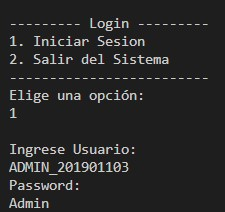
> *Menu principal.*
>

> #### Administrador
>
> Registra los empleados, las imagenes, los clientes registrados, y a los clientes que se atenderán, por medio de archivos csv, por lo que es necesario ingresar la url de la ubicación del archivo, como se muestra en las imagenes.
>
> 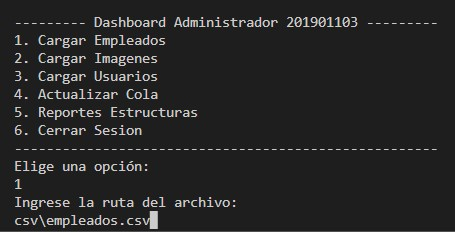
> *Opción cargar empleados.*
>
> 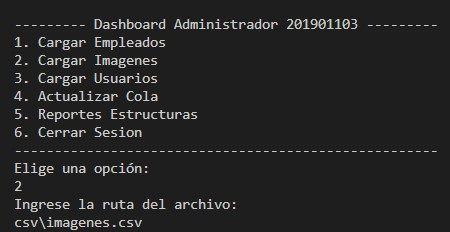
> *Opción cargar imagenes.*
>
> 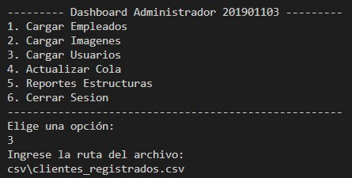
> *Opción cargar clientes registrados.*
>
> 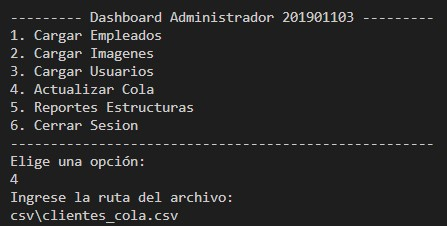
> *Opción cargar clientes a la cola.*
>
> La opción 5 permitirá la observación de la imagen de los reportes correspondientes a la estructura utilizada para almacenar cada uno de los datos de las opciones anteriores. ver las siguientes imagenes.
>
> 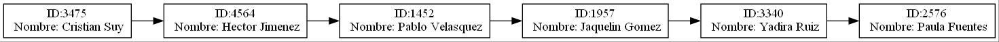
> *Reporte lista simple, correspondiente a empleados.*
>
> 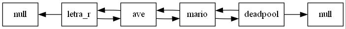
> *Reporte lista doblemente enlazada, correspondiente a imagenes.*
>
> 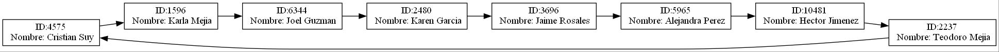
> *Reporte lista circular enlazada, correspondiente a clientes registrados.*
>
> 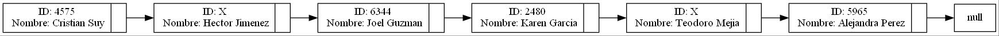
> *Reporte cola, correspondiente a clientes a actualizar.*
>

> #### Menu Empleados
> Maneja la visualización de las imagenes, así como el control del pedido de cada uno de los clientes que se encuentran en la cola, y si un cliente no se encuentra registrado, permite agregarlo como cliente nuevo, mostrando su respectivo id, y agregandolo a la lista de clientes registrados. Cuando se inicia sesión automaticamente se mostrará el usuario que realizó el login.
>
> 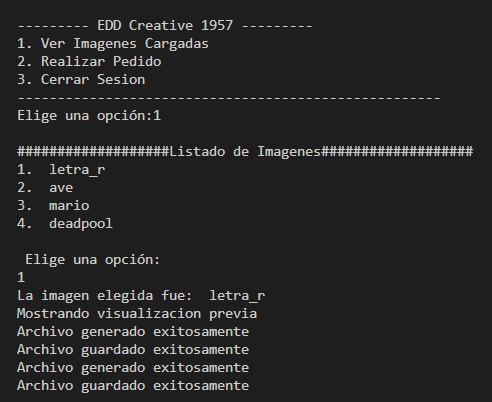
> *Opción para ver imagenes previas.*
>
> 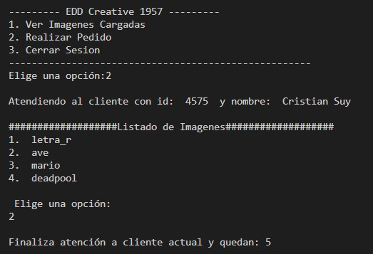
> *Opción para realizar los pedidos.*
>
> Si el usuario elige la opción número 1, entonces se muestra la lista de imagenes cargadas en el sistema, y podrá elegir cual de estas opciones desea visualizar, y cuando lo seleccione, automaticamente se generará la imagen, ver la siguiente imagen.
>
> 
> *Visualización de la imagen seleccionada.*
>
> Para la opción número 2, correspondiente a realizar pedido, se muestra nuevamente la lista de imagenes y cada vez que un cliente almacenado en la cola elige una opción automaticamente este cliente se elimina de la cola y se almacena en la pila, por lo que se debe seleccionar la imagen para cada cliente que continue en la cola, hasta que esta finalice, y luego se muestra el reporte de la pila con los datos del cliente y la imagen que seleccionó, además taqmbién se genera un archivo JSON con los datos de la pila, ver la siguientes imagenes correspondientes a los reportes.
>
> 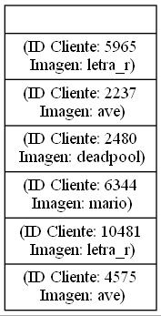
> *Visualización del reporte con los datos de los clientes con la imagen elegida.*
>
> 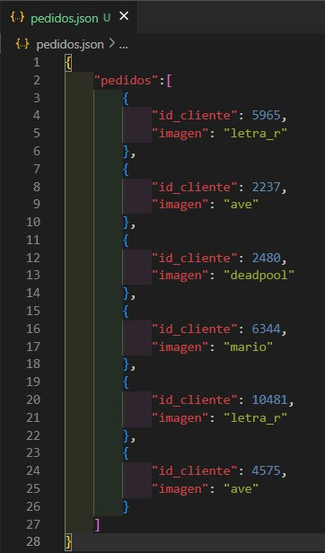
> *Visualización del reporte JSON con los datos de los clientes con la imagen elegida.*
>

## **MANUAL TECNICO**

EDD Creative maneja la información por medio de carga masiva de archivos de tipo csv, los cuales contienen la información necesaria para la interacción con los empleados.

