# EDD_VJ1S2023_PY_201901103

## **MANUAL USUARIO**

EDD Creative es un proyecto que permite la interacción con el usuario a traves consola, contando con el menú principal, en el cual el administrador es el que carga los datos de los empleados, imagenes, y clientes, por medio de archivos csv.

> #### Login
>
> Cuando se inicia el programa solamente podrá acceder al menú administrador con el siguiente usuario: ADMIN_201901103 y con la contraseña: Admin.
> Al momento de presionar en el botón, podrá visualizar el menú administrador, ver imagen en Administrador.
> Cuenta con dos opciones para cargar los archivos y dos para mostrar reportes, las cuales se muestran en la siguiente imagen.
>
> 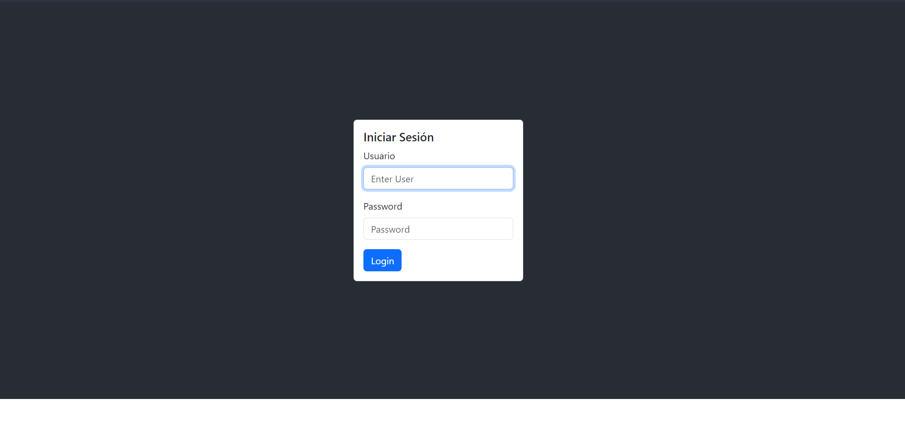
> *Menu principal.*
>

> #### Administrador
>
> Registra los empleados y los pedidos, por medio de archivos csv y json respectivamente, por lo que es necesario ingresar la url de la ubicación del archivo, como se muestra en las imagenes.
>
> 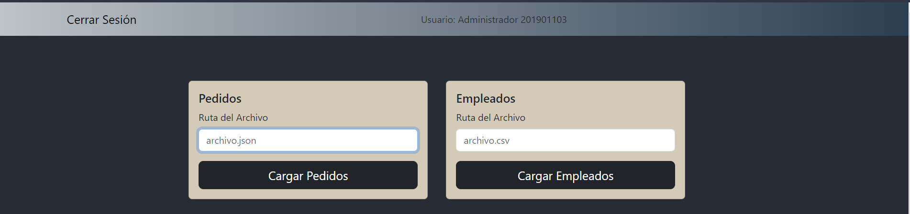
> *Opción cargar empleados y pedidos.*
>
> 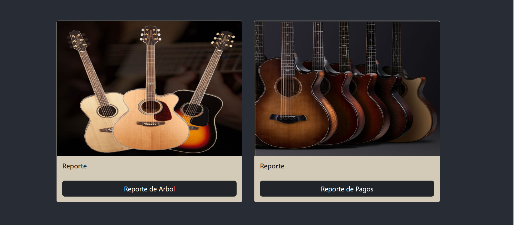
> *Opción visualizar reportes, antes de presionar el boton muestra una imagen previa.*
>
> La opción de los reportes correspondientes a la estructura utilizada para almacenar cada uno de los datos de las opciones anteriores. ver las siguientes imagenes.
>
> 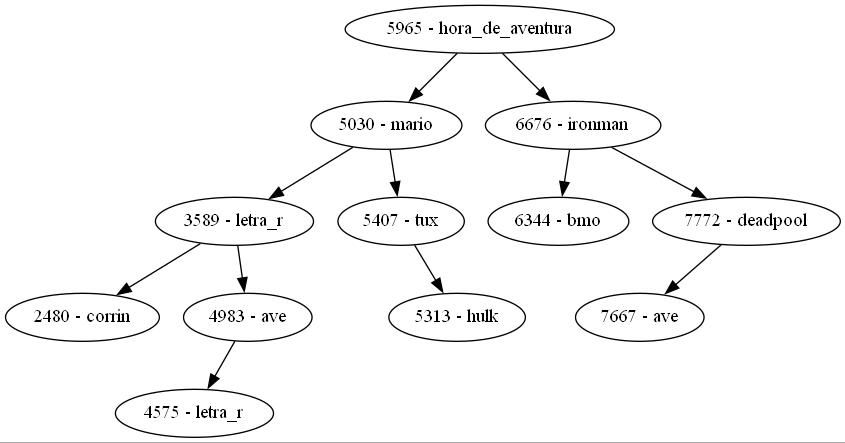
> *Reporte arbol AVL, correspondiente a clientes con imagen.*
>
> 
> *Reporte blockchain.*
>

> #### Menu Empleados
> Maneja las opciones para escoger filtros, generar facturas, historial de facturas, e historial de ventas completadas, así como el control del pedido de cada uno de los clientes que se encuentran en la cola, mostrando su respectivo id al presionar el botón de Iniciar atención y quitando al cliente de la lista al presionar el boton de finalizar atención. Cuando se inicia sesión automaticamente se mostrará el usuario que realizó el login.
>
> 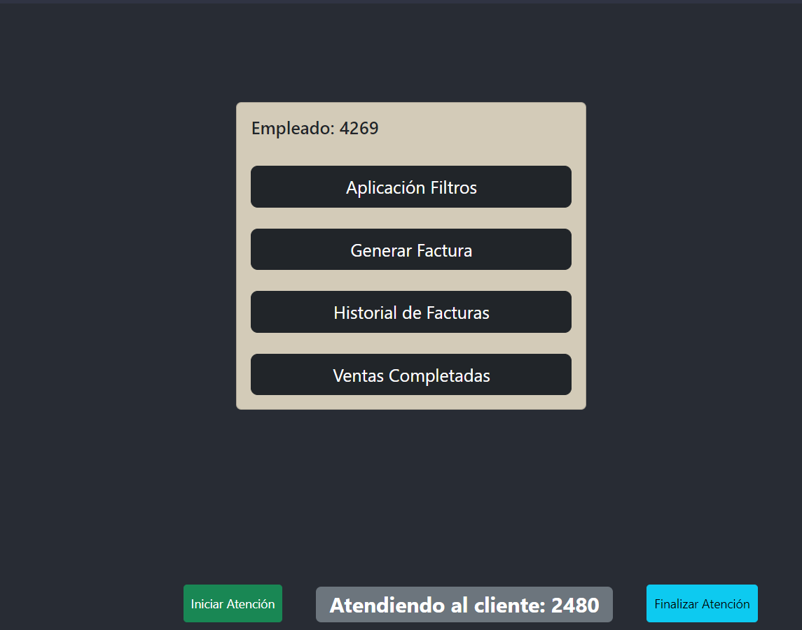
> *Opciones de la ventana de empleados.*
>
> Si el empleado presiona el boton de aplicación filtros, entonces se muestra la lista de filtros que puede aplicar a la imagen obtenida al presionar el boton verde, además en la parte derecha observará la visualización en ejemplo de como son los filtros y así el usuario pueda elegir adecuadamente, y cuando lo seleccione, automaticamente se generará la imagen, ver la siguiente imagen.
>
> 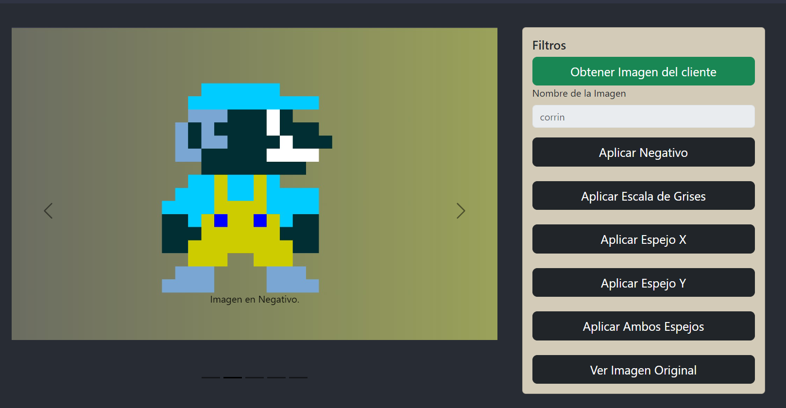
> *Visualización de las opciones para los filtros.*
>
> 
> *Visualización de una imagen generada en escala de grises.*
>
> Para la opción generar factura, se muestra un formulario que contiene datos sobre el cliente que se esta atendiendo, el empleado que atiende al cliente, y la fecha con hora en la que se está realizando el pago, además se debe ingresar el precio de los filtros que se hayan elegido en la opción anterior, luego se presiona el boton para generar la factura, la cual se almacena en la tabla hash y blockchain.
>
> 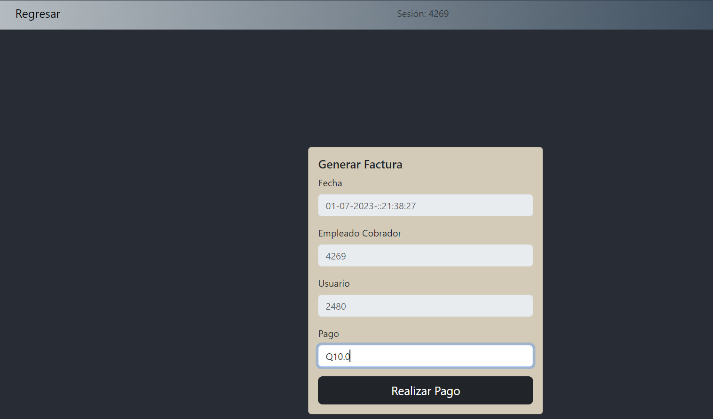
> *Visualización del formulario correspondiente a la generación de facturas.*
>
> Para la opción historial de facturas, se muestra una tabla con los datos de id cliente y id factura, entre mas generaciones de facturas se realicen, estas apareceran en esta tabla.
>
> 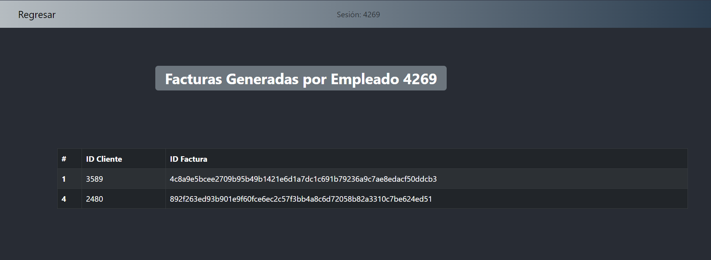
> *Visualización de la tabla correspondiente al historial de facturas.*
>
> Para la opción de visualización de ventas completadas, se muestra una tabla con los datos de id cliente, imagen y filtros. Ademas, se muestra la opción para visualizar el reporte del grafo.
>
> 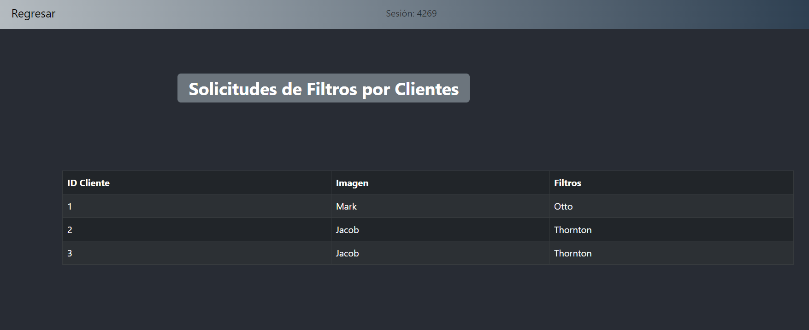
> *Visualización de la tabla.*
>
> 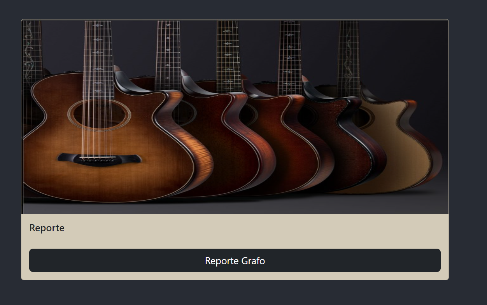
> *Visualización del esepacio para obtener el reporte de grafo*
>
> Despues de presionar el boton para ver el reporte se visualizará una imagen como la siguiente.
> 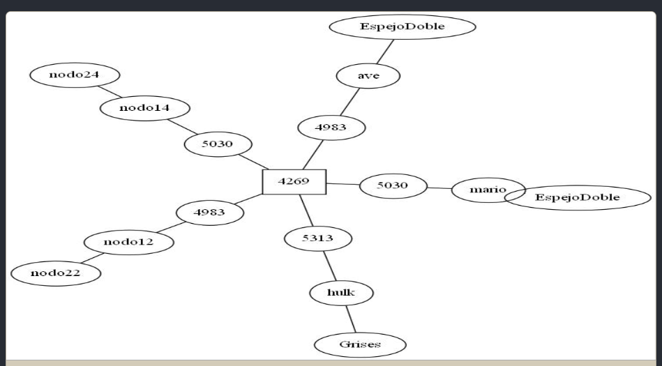
> *Visualización del reporte de grafo*
>

## **MANUAL TECNICO**

EDD Creative maneja la información por medio de carga masiva de archivos de tipo csv, los cuales contienen la información necesaria para la interacción con los empleados. 
Para la creación del software se utiliza en el Backend el lenguaje de programación go, y para el frontend el framework React.

> ### Petición Post para login
>
> Para comenzar con la estructura del software se realiza la petición Post utilizando la libreria fiber. Para mayor información de la libreria haga click en el enlace: https://github.com/gofiber/fiber. En el codigo que se muestra a continuación se observa que se crea el metodo post y para ello se debe utilizar los cors, los cuales permiten una mejor interación con el frontend al recibir los datos desde el mismo, por lo que es necesario realizar un enlace, y para ello se observa el /login, este enlace irá en la parte del frontend para realizar correctamente la petición, ya que de esta forma no ocurriran errores, algo que se debe tomar en cuenta es que cuando se reciben los datos es a traves de archivos json, por lo que se crea una variable para recibir estos datos, y para ello se utiliza c.BodyParser, luego se accede a la referencia del dato recibido desde el frontend y se envian los datos a traves del metodo sesión, el cual se explicará mas adelante, este metodo retornara un valor que será validado para saber que respuesta se envia al frontend, por lo que dependiendo de la respuesta se enviará a la pagina de administrador, la de empleado o indicando que el usuario no existe.
>
```go
app := fiber.New()
app.Use(cors.New())

app.Post("/login", func(c *fiber.Ctx) error {
	jsonData := new(DatosUser)
	if err := c.BodyParser(jsonData); err != nil {
		return err
	}
	usuarioRecibido := jsonData.Usuario
	passwordRecibido := jsonData.Password
	//fmt.Println(usuarioRecibido)
	//fmt.Println(passwordRecibido)
	validacionIniciar := sesion(usuarioRecibido, passwordRecibido)
	valorEmpleado = usuarioRecibido
	if validacionIniciar == "Administrador 201901103" {
		//fmt.Print("Administrador 201901103")
		return c.JSON(&fiber.Map{
			"data": "Administrador",
		})
	}
	if validacionIniciar != "No" {
		//fmt.Print("Cualquier usuario")
		tabHash = &estructura.TablaHash{Capacidad: 5, Utilizacion: 0}
		tabHash.NewTablaHash()
		return c.JSON(&fiber.Map{
			"data": "SI",
		})
	} else {
		//fmt.Print("Usuario o contraseña incorrectos")
		return c.JSON(&fiber.Map{
			"data": "NO",
		})
	}
})
```
> ### Función para sesion
>
> La función sesion recibe como parametro el usuario y la contraseña para ser validados dentro del if, si corresponde al administrador retorna "Administrador 201901103", si no corresponde al administrador, ingresara a la lista simple para validar si el usuario y la contraseña se encuentran en el sistema, si esa validación es correcta, entonces retorna el usuario, de lo contrario retorna la palabra "No" en el caso de que no corresponda al admin o a ningun dato almacenado en la lista. 
>
```go
func sesion(usuario string, password string) string {
	if usuario == "ADMIN_201901103" && password == "Admin" {
		//menuAdministrador()
		return "Administrador 201901103"
	} else {
		validandoExistencia := listaSimple.Validar(usuario, password)
		if validandoExistencia {
			//menuEmpleado(usuario)
			return usuario
		}
	}
	return "No"
}
```

> ### Petición Post para cargar empleados
>
> Se crea la función Post que recibirá la ruta de la ubicación del archivo csv con los datos de los empleados, este recibe la url y la almacena en una variable que se envia como parametro hacia la función cargarEmpleados, la cual devolverá una respuesta booleana para indicar si se cargó correctamente el archivo. o si ocurrió algun error. 
>
```go
app.Post("/cargaEmpleados", func(c *fiber.Ctx) error {
		//return c.SendString("Hello, World!")
		jsonUrl := new(URLempleado)
		if err := c.BodyParser(jsonUrl); err != nil {
			return err
		}
		rutaRecibida := jsonUrl.Ruta
		validacionleer := cargarEmpleados(rutaRecibida)

		if validacionleer {
			return c.JSON(&fiber.Map{
				"data": "archivo cargado correctamente",
			})
		}

		return c.JSON(&fiber.Map{
			"data": "error al cargar archivo",
		})
	})
```

> ### Metodo para cargar empleados
>
> Se crea la variable para la ruta que ingresa el usuario, de esa manera se lee el archivo correctamente, por lo que se utiliza la funcion Open, la cual recibe como parametro la ruta del archivo, y si existe algún error con el archivo, entonces se muestra un mensaje indicando que ha ocurrido un error, y de lo contrario con defer file close se cierra el archivo, y con la funcion transform NewReader se garantiza que el archivo lea los datos independientemente de los tipos de caracteres que incluya el mismo, por lo que esta variable se envía a NewReader del csv para así leer todo el archivo, luego se indica con Comma cual será el caracter que separa los datos, despues con RedAll se leen todas las lineas del archivo, luego si ocurre algun error al leer las lineas se muestra un mensaje en pantalla con el error que ha ocurrido, si no existe ningun error, entonces continua con el bucle, el cual se encarga de recorrer cada dato de cada linea y así poder validar con el if si la linea es la cabecera, entonces lo omite, de lo contrario accede a cada valor, y se envia como parametro al metodo Insertar de la lista simple, indicando con TrimSpace que los datos no tengan espacios extras.
>
```go
func cargarEmpleados(ruta string) bool {
	// Abre el archivo CSV
	file, err := os.Open(ruta)
	if err != nil {
		//fmt.Println("Error al abrir el archivo:", err)
		return false
	}
	defer file.Close()

	// Crea un lector con transformador UTF-8
	//utf8Reader := transform.NewReader(file, unicode.UTF8.NewDecoder())

	// Crea un nuevo lector CSV
	reader := csv.NewReader(file)
	reader.Comma = ','

	// Lee todas las líneas del archivo
	lines, err := reader.ReadAll()
	if err != nil {
		//fmt.Println("Error al leer el archivo:", err)
		return false
	}

	// Itera sobre las líneas y muestra los datos
	for _, line := range lines {
		if line[0] != "id" {
			//fmt.Println(line[0], " ", line[1], " ", line[2], " ", line[3])
			listaSimple.Insertar(strings.TrimSpace(line[0]), strings.TrimSpace(line[1]), strings.TrimSpace(line[2]), strings.TrimSpace(line[3]))
		}
	}
	//listaSimple.Mostrar()
	//fmt.Println("Carga exitosa")
	return true
}
```

> ### Petición Post para cargar pedidos
>
> Se crea la función Post que recibirá la ruta de la ubicación del archivo json con los datos de los clientes y las imagenes, este recibe la url y la almacena en una variable que se envia como parametro hacia la función cargarJson, la cual devolverá una respuesta booleana para indicar si se cargó correctamente el archivo. o si ocurrió algun error. Ademas se envia la estructura cola para almacenar en orden los datos de los clientes y así poder atenderlos correctamente, por lo que se llama al metodo InOrder del arbol AVL.
>
```go
app.Post("/cargarPedidos", func(c *fiber.Ctx) error {
	jsonUrl := new(URLempleado)
	if err := c.BodyParser(jsonUrl); err != nil {
		return err
	}
	rutaRecibida := jsonUrl.Ruta
	validacionleer := cargarJson(rutaRecibida)
	arbol.InOrder(clientesCola)
	if validacionleer {
		return c.JSON(&fiber.Map{
			"data": "archivo cargado correctamente",
		})
	}

	return c.JSON(&fiber.Map{
		"data": "error al cargar archivo",
	})
})
```

> ### Función para cargar pedidos
>
> Se crea una variable que obtendrá la ruta del archivo json, el cual será abierto por medio de la función Open y almacenada el la variable file, luego se valida que no existan errores, luego se cierra el archivo con file.Close y despues se utiliza ReadAll y se pasa por parametro el file y así se utiliza la variable byteValue, y si no existe error se utiliza el struct objeto para obtener la lista de Pedidos del json, y con Unmarshal se obtiene el objeto y si no existe ningun error, se recorre con un for el objeto de pedidos, para luego almacenar en el arbol AVL los datos del id del cliente y de la imagen correspondiente al cliente y si no ha ocurrido ningún error retorna true.
>
```go
func cargarJson(ruta string) bool {
	file, err := os.Open(ruta)
	if err != nil {
		return false
	}
	defer file.Close()
	byteValue, err := ioutil.ReadAll(file)
	if err != nil {
		return false
	}

	var objeto struct {
		Pedidos []Pedi `json:"pedidos"`
	}

	err = json.Unmarshal(byteValue, &objeto)
	if err != nil {
		return false
	}

	for _, pedi := range objeto.Pedidos {
		idTempo := pedi.ID
		imagenTempo := pedi.Imagen
		arbol.InsertarElemento(idTempo, imagenTempo)
	}
	return true
}
```

> ### Metodo para cargar clientes
>
> Se crea una variable que obtendrá la ruta del archivo de imagenes csv, el cual será abierto de la misma manera como se explica en el metodo de cargar empleados, con la variacion que ahora los datos se insertan en la lista circular, ademas se crea una bandera de encabezado, para omitir el mismo, cuando se encuentre en el archivo.
>
```go
func cargarClientes() {
	var ruta string
	fmt.Println("Ingrese la ruta del archivo: ")
	fmt.Scanln(&ruta)

	// Abre el archivo CSV
	file, err := os.Open(ruta)
	if err != nil {
		fmt.Println("Error al abrir el archivo:", err)
		return
	}
	defer file.Close()

	// Crea un lector con transformador UTF-8
	utf8Reader := transform.NewReader(file, unicode.UTF8.NewDecoder())

	// Crea un nuevo lector CSV
	reader := csv.NewReader(utf8Reader)
	reader.Comma = ','
	encabezado := true

	for {
		lines, err := reader.Read()
		if err == io.EOF {
			break
		}
		if err != nil {
			fmt.Println("Error al leer la linea del archivo")
			continue
		}
		if encabezado {
			encabezado = false
			continue
		}
		listaCircular.Insertar(strings.TrimSpace(lines[0]), strings.TrimSpace(lines[1]))
	}
}
```

> ### Metodo para cargar clientes en cola
>
> Se crea una variable que obtendrá la ruta del archivo de imagenes csv, el cual será abierto de la misma manera como se explica en el metodo de cargar empleados, con la variacion que ahora los datos se insertan en la cola, ademas se crea una bandera de encabezado, para omitir el mismo, cuando se encuentre en el archivo.
>
```go
func cargarActualizarCola() {
	var ruta string
	fmt.Println("Ingrese la ruta del archivo: ")
	fmt.Scanln(&ruta)

	// Abre el archivo CSV
	file, err := os.Open(ruta)
	if err != nil {
		fmt.Println("Error al abrir el archivo:", err)
		return
	}
	defer file.Close()

	// Crea un lector con transformador UTF-8
	utf8Reader := transform.NewReader(file, unicode.UTF8.NewDecoder())

	// Crea un nuevo lector CSV
	reader := csv.NewReader(utf8Reader)
	reader.Comma = ','
	encabezado := true

	for {
		lines, err := reader.Read()
		if err == io.EOF {
			break
		}
		if err != nil {
			fmt.Println("Error al leer la linea del archivo")
			continue
		}
		if encabezado {
			encabezado = false
			continue
		}
		clientesCola.Encolar(strings.TrimSpace(lines[0]), strings.TrimSpace(lines[1]))
	}
}
```

> ### Metodo para generar reportes
>
> Se crea
>
```go
```

> ### Metodo para el menu de empleados
>
> Se crea la variable opcion para manejar la entrada por consola escrita por el usuario, por lo tanto con el bucle for se indica que es diferente de la opcion cerrar sesión, para así poder regresar al menú principal ya que finaliza la ejecución del bucle, además con el switch verifica a que opción corresponde, las opciones se verán más adelante.
>
```go
func menuEmpleado(usuario string) {
	var opcion int
	for opcion != 4 {
		fmt.Printf(`
--------- EDD Creative %s ---------
1. Ver Imagenes Cargadas
2. Realizar Pedido
3. Capas
4. Cerrar Sesion
-----------------------------------------------------
Seleccione una opción:`, usuario)

		fmt.Scanln(&opcion)

		switch opcion {
		case 1:
			nameImagen := visualizarImagenes()
			fmt.Println("La imagen elegida fue: ", nameImagen, "\nMostrando visualizacion previa")
			previaVisualizacion(nameImagen)
		case 2:
			realizarPedidos(usuario)
			pedidosPila.ReportePila()
			pedidosPila.ReporteJson()
		case 3:
			nameImagen := visualizarImagenes()
			fmt.Println("La imagen elegida fue: ", nameImagen, "\nMostrando visualizacion previa")
			realizarCapa(nameImagen)
		}

	}
}
```

> ### Función para visualizar las imagenes
>
> Se crea una opción para validar la entrada del usuario, luego se manda a llamar la lista de datos correspondiente a las imagenes, las cuales estan almacenadas en la lista doble, además despues de haber obtenido la opcion, esta se envia como parametro a traves de la funcion BuscarImagen, y devuelve el nombre de la imagen y luego retorna este nombre para almacenarla en la variable desde donde se realiza la invocación a la función.
>
```go
func visualizarImagenes() string {
	var opcion int
	fmt.Println("\n###################Listado de Imagenes###################")
	listaDoble.ListarDatos()
	fmt.Println("\n Seleccione una opción:")
	fmt.Scanln(&opcion)
	nameImagen := listaDoble.BuscarImagen(strconv.Itoa(opcion))
	return nameImagen
	//Falta la opcion de visualizar la imagen
}
```

> ### Función para la primera opcion correspondiente a visualización previa
>
> Se crea la variable de matriz, la cual inicializará los valores de la raiz hacia el nodo de la matriz, con los datos de posiciones en -1 debido a que todos los datos dentro de la matriz pueden iniciar con el nodo 0 e ir aumentando conforme sea necesario, y por esa razón tampoco se le indica un color en especifico, además se envía de manera inicial por medio de parametro la ruta correspondiente a la ubicación de la carpeta con las configuraciones para las imagenes, esta es csv más el nombre de la imagen recibida por parametro y el inicial.csv para la lectura de las capas que tendrá el archivo, y nuevamente se agrega el nombre de la imagen la cual será para la extensión del archivo css y html, por lo que se manda a llamar el metodo GenerarImagen, luego simplemente se inicializa la matriz, para volver a generar otra imagen de ser necesario.
>
```go
func previaVisualizacion(nameImagen string) {
	var matrizImages = &estructura.Matriz{Raiz: &estructura.NodoMatriz{PosicionX: -1, PosicionY: -1, Color: "RAIZ"}}
	matrizImages.LeerInicial("csv/"+nameImagen+"/inicial.csv", nameImagen)
	matrizImages.GenerarImagen(nameImagen)
	matrizImages = &estructura.Matriz{Raiz: nil}
}
```

> ### Metodo para realizar pedidos
>
> Se crea un bucle infinito que sirve para obtener los datos actuales de la cola, en este caso el id y nombre del cliente, así como el tamaño de la misma, luego con un if se valida si la longitud de la cola es diferente de 0, esto para indicar que cuando sea igual a 0 se finaliza el bucle, luego se muestra un mensaje indicando cual es el cliente que se está atendiendo, se valida si el cliente no está registrado en la lista circular, por lo que se crea otro bucle dentro de la validación cuando sea igual a X, este bucle servirá para que se repita la generación del id en caso de que este exista, de esta forma aseguramos que solo existan id unicos en el sistema, luego se valida cuando el usuario no existe, entonces se muestran las imagenes disponibles en el sistema, por lo que el usuario puede elegir una imagen y luego se ingresa el cliente nuevo a la lista circular, además se agrega el id del cliente, el id del empleado y la imagen elegida a la pila, luego se indica por medio de un mensaje cual es el id para determinado cliente, y se saca de la cola al cliente atendido y se utiliza un break para romper el bucle, luego en el else correspondiente a la validación si es diferente de X, se vuelve a validar si el cliente se encuentra en el sistema, y se visualizan las imagenes, se agrega el usuario a la pila, y se elimina el usuario de la cola, luego si no existe el cliente, simplemente se agrega a la lista circular y se vuelven a realizar las asignaciones.
>
```go
func realizarPedidos(usuario string) {
	for {
		idcolaClientes := clientesCola.ObtenerClienteId()
		nameColaClientes := clientesCola.ObtenerClienteName()
		longi := clientesCola.ObtenerLongitud()
		if longi != 0 {
			fmt.Println("\nAtendiendo al cliente con id: ", idcolaClientes, " y nombre: ", nameColaClientes)

			if strings.ToUpper(idcolaClientes) == "X" {
				// CUANDO ES IGUAL A X VALIDAR UN ID RANDOM Y
				for {
					valor := (rand.Intn(10000)) + 1000

					existe := listaCircular.ValidarRepetidos(strconv.Itoa(valor))
					if existe == true {
						//repetir el aleatorio y no guardar nada
					} else {
						// guardar el aleatorio como nuevo id y agregarlo a la lista circular junto al nombre del cliente
						nombreImagenElegida := visualizarImagenes()
						//Sino existe en la lista circular agregar al cliente en la lista circular
						listaCircular.Insertar(strconv.Itoa(valor), nameColaClientes)
						pedidosPila.Push(strconv.Itoa(valor), usuario, nombreImagenElegida)
						//agregar el id del cliente, id del empleado, y nombre de la imagen elegida
						fmt.Println("\nEl nuevo id: ", strconv.Itoa(valor), "corresponde al cliente: ", nameColaClientes)
						clientesCola.Descolar()
						break
					}
				}

			} else {
				existe := listaCircular.ValidarRepetidos(strings.TrimSpace(idcolaClientes))
				if existe == true {
					// si el cliente existe en la lista circular de clientes
					nombreImagenElegida := visualizarImagenes()
					pedidosPila.Push(idcolaClientes, usuario, nombreImagenElegida)
					//agregar el id del cliente, id del empleado, y nombre de la imagen elegida
					clientesCola.Descolar()
				} else {
					nombreImagenElegida := visualizarImagenes()
					//Sino existe en la lista circular agregar al cliente en la lista circular
					listaCircular.Insertar(idcolaClientes, nameColaClientes)
					pedidosPila.Push(idcolaClientes, usuario, nombreImagenElegida)
					//agregar el id del cliente, id del empleado, y nombre de la imagen elegida
					clientesCola.Descolar()
				}

			}
			fmt.Println("\nFinaliza atención a cliente actual y quedan:", strconv.Itoa(longi-1))
		} else {
			break
		}
	}
}
```

> ### Metodo para generar las capas
>
> Se crea nuevamente la inicialización de la matriz, haciendo la creación del nodo raiz con las posiciones en -1 y color como raiz, luego se crea una lista simple para almacenar las capas, se envia por parametros al meotodo leerInicial1 la ruta del archivo con el nombre de la imagen, y la lista simple de capas, esto solamente sirve para obtener cada capa y luego poder seleccionar solamente una, entonces se vuelve a inicializar la matriz enviandole nulo a la raiz. Despues se crea una variable de opcion la cual servirá directamente para poder elegir la capa a visualizar, por lo que se listan las capas que corresponden a la imagen elegida, luego se busca el nombre de la capa en la lista simple, y se alamcena en la variable nameCapa, se inicia nuevamente la matriz, y se manda a llamar al metodo leer inicial y capa elegida, esto para enviarle el nombre de la imagen, la ruta de la imagen, y el nombre de la capa, y así generar el archivo correspondiente al reporte de la matriz por capas, luego se inicializa nuevamente la matriz.
>
```go
func realizarCapa(nameImagen string) {
	var matrizImages1 = &estructura.Matriz{Raiz: &estructura.NodoMatriz{PosicionX: -1, PosicionY: -1, Color: "RAIZ"}}
	var listaCapasMatriz = estructura.NewListaSimpleCapa()
	matrizImages1.LeerInicial1("csv/"+nameImagen+"/inicial.csv", nameImagen, listaCapasMatriz)
	matrizImages1 = &estructura.Matriz{Raiz: nil}

	var opcion int
	fmt.Println("\n=================Listado de Capas=================")
	listaCapasMatriz.ListarDatosCapa()
	fmt.Println("\n Seleccione una opción:")
	fmt.Scanln(&opcion)
	nameCapa := listaCapasMatriz.BuscarCapa(strconv.Itoa(opcion))
	matrizImages1 = &estructura.Matriz{Raiz: &estructura.NodoMatriz{PosicionX: -1, PosicionY: -1, Color: "RAIZ"}}
	matrizImages1.LeerInicialYCapaElegida("csv/"+nameImagen+"/inicial.csv", nameImagen, nameCapa)
	matrizImages1 = &estructura.Matriz{Raiz: nil}
}
```

> ### Lista Simple
>
> se crean las estructuras, la primera es de tipo Empleado, esto indica que obtendrá los datos dentro del mismo, la segunda es de tipo nodo, el cual es de tipo Nodo, este nos sirve para almacenar la data el cual apunta hacia Empleado, luego el siguiente, sirve para apuntar al siguiente nodo, y la ultima parte de ListaSimple, indica que tendrá un inicio apuntando hacia nodo, y una longitud que servirá para saber el tamaño de la lista.
>
```go
type Empleado struct {
	id     string
	name   string
	cargo  string
	passwd string
}

type Nodo struct {
	data      *Empleado
	siguiente *Nodo
}

type Lista_simple struct {
	Inicio   *Nodo
	Longitud int
}
```

> 
> El metodo esta Vacia, retorna un valor booleano, en el caso de que la longitud de la lista sea igual a 0 devuelve true, y en caso contrario devuelve false.
> 

```go
func (lista *Lista_simple) estaVacia() bool {
	if lista.Longitud == 0 {
		return true
	}
	return false
}
```

>
> El metodo insertar, recibe como parametro el id, nombre, cargo y contraseña del empleado, luego se crea un empleado con estos datos, luego se valida si la lista está vacia, y si es true, entonces se crea el inicio apuntando los datos al nodo y indicamos que el siguiente de ese nodo apunta a nulo, luego en caso contrario a estar vacía la lista, se accede al inicio de la lista, luego con un bucle for se recorre la lista pasando al siguiente hasta que el siguiente apunte a nulo, por lo que despues se indica que el siguiente del ultimo nodo apunta a un nuevo nodo con el dato de empleado y siguiente apuntando a nulo, y para finalizar simplemente se aumenta la unidad de la longitud para indicar que la lista va creciendo.
>

```go
func (lista *Lista_simple) Insertar(id string, name string, cargo string, passwd string) {
	empleado := &Empleado{id: id, name: name, cargo: cargo, passwd: passwd}
	if lista.estaVacia() {
		lista.Inicio = &Nodo{data: empleado, siguiente: nil}
		lista.Longitud++
	} else {
		aux := lista.Inicio
		for aux.siguiente != nil { //esto simula un while
			aux = aux.siguiente
		}
		aux.siguiente = &Nodo{data: empleado, siguiente: nil}
		lista.Longitud++
	}
}
```

 >
 > La funcion validar permite recibir como parametro al usuario, y la contraseña, accediendo al inicio de la lista, luego con un bucle for se recorre la lista hasta que el nodo sea nulo, por lo que con un if se valida si el usuarioi y la contraseña son iguales a los almacenados en la lista, y si son iguales retorna true, de lo contrario finaliza el bucle y devuelve false.
 >

 ```go
func (lista *Lista_simple) Validar(usuario string, password string) bool {
	aux := lista.Inicio
	for aux != nil {
		if usuario == aux.data.id && password == aux.data.passwd {
			return true
		}
		aux = aux.siguiente
	}
	return false
}
```

>
> El metodo mostrar simplemente accede al inicio de la lista, luego con un bucle recorre los nodos hasta que sea igual a nulo, con un println mostramos en consola los datos almacenados en la lista, luego avanzamos de nodo hacia el siguiente.
>
```go
func (lista *Lista_simple) Mostrar() {
	aux := lista.Inicio

	for aux != nil {
		fmt.Println(aux.data.id, " ", aux.data.name, " ", aux.data.cargo, " ", aux.data.passwd)
		aux = aux.siguiente
	}
}
```