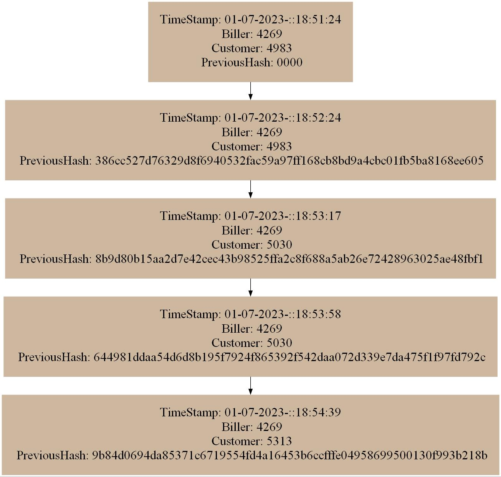

# EDD_VJ1S2023_PY_201901103

## **MANUAL USUARIO**

EDD Creative es un proyecto que permite la interacción con el usuario a traves consola, contando con el menú principal, en el cual el administrador es el que carga los datos de los empleados, imagenes, y clientes, por medio de archivos csv.

> #### Login
>
> Cuando se inicia el programa solamente podrá acceder al menú administrador con el siguiente usuario: ADMIN_201901103 y con la contraseña: Admin.
> Al momento de presionar en el botón, podrá visualizar el menú administrador, ver imagen en Administrador.
> Cuenta con dos opciones para cargar los archivos y dos para mostrar reportes, las cuales se muestran en la siguiente imagen.
>
> 
> *Menu principal.*
>

> #### Administrador
>
> Registra los empleados y los pedidos, por medio de archivos csv y json respectivamente, por lo que es necesario ingresar la url de la ubicación del archivo, como se muestra en las imagenes.
>
> 
> *Opción cargar empleados y pedidos.*
>
> 
> *Opción visualizar reportes, antes de presionar el boton muestra una imagen previa.*
>
> La opción de los reportes correspondientes a la estructura utilizada para almacenar cada uno de los datos de las opciones anteriores. ver las siguientes imagenes.
>
> 
> *Reporte arbol AVL, correspondiente a clientes con imagen.*
>
> 
> *Reporte blockchain.*
>

> #### Menu Empleados
> Maneja las opciones para escoger filtros, generar facturas, historial de facturas, e historial de ventas completadas, así como el control del pedido de cada uno de los clientes que se encuentran en la cola, mostrando su respectivo id al presionar el botón de Iniciar atención y quitando al cliente de la lista al presionar el boton de finalizar atención. Cuando se inicia sesión automaticamente se mostrará el usuario que realizó el login.
>
> 
> *Opciones de la ventana de empleados.*
>
> Si el empleado presiona el boton de aplicación filtros, entonces se muestra la lista de filtros que puede aplicar a la imagen obtenida al presionar el boton verde, además en la parte derecha observará la visualización en ejemplo de como son los filtros y así el usuario pueda elegir adecuadamente, y cuando lo seleccione, automaticamente se generará la imagen, ver la siguiente imagen.
>
> 
> *Visualización de las opciones para los filtros.*
>
> 
> *Visualización de una imagen generada en escala de grises.*
>
> Para la opción generar factura, se muestra un formulario que contiene datos sobre el cliente que se esta atendiendo, el empleado que atiende al cliente, y la fecha con hora en la que se está realizando el pago, además se debe ingresar el precio de los filtros que se hayan elegido en la opción anterior, luego se presiona el boton para generar la factura, la cual se almacena en la tabla hash y blockchain.
>
> 
> *Visualización del formulario correspondiente a la generación de facturas.*
>
> Para la opción historial de facturas, se muestra una tabla con los datos de id cliente y id factura, entre mas generaciones de facturas se realicen, estas apareceran en esta tabla.
>
> 
> *Visualización de la tabla correspondiente al historial de facturas.*
>
> Para la opción de visualización de ventas completadas, se muestra una tabla con los datos de id cliente, imagen y filtros. Ademas, se muestra la opción para visualizar el reporte del grafo.
>
> 
> *Visualización de la tabla.*
>
> 
> *Visualización del esepacio para obtener el reporte de grafo*
>
> Despues de presionar el boton para ver el reporte se visualizará una imagen como la siguiente.
> 
> *Visualización del reporte de grafo*
>

## **MANUAL TECNICO**

EDD Creative maneja la información por medio de carga masiva de archivos de tipo csv, los cuales contienen la información necesaria para la interacción con los empleados. 
Para la creación del software se utiliza en el Backend el lenguaje de programación go, y para el frontend el framework React.

> ### Petición Post para login
>
> Para comenzar con la estructura del software se realiza la petición Post utilizando la libreria fiber. Para mayor información de la libreria haga click en el enlace: https://github.com/gofiber/fiber. En el codigo que se muestra a continuación se observa que se crea el metodo post y para ello se debe utilizar los cors, los cuales permiten una mejor interación con el frontend al recibir los datos desde el mismo, por lo que es necesario realizar un enlace, y para ello se observa el /login, este enlace irá en la parte del frontend para realizar correctamente la petición, ya que de esta forma no ocurriran errores, algo que se debe tomar en cuenta es que cuando se reciben los datos es a traves de archivos json, por lo que se crea una variable para recibir estos datos, y para ello se utiliza c.BodyParser, luego se accede a la referencia del dato recibido desde el frontend y se envian los datos a traves del metodo sesión, el cual se explicará mas adelante, este metodo retornara un valor que será validado para saber que respuesta se envia al frontend, por lo que dependiendo de la respuesta se enviará a la pagina de administrador, la de empleado o indicando que el usuario no existe. Por ultimo se indica que el backend tendrá el puerto 5000
>
```go
app := fiber.New()
app.Use(cors.New())

app.Post("/login", func(c *fiber.Ctx) error {
	jsonData := new(DatosUser)
	if err := c.BodyParser(jsonData); err != nil {
		return err
	}
	usuarioRecibido := jsonData.Usuario
	passwordRecibido := jsonData.Password
	//fmt.Println(usuarioRecibido)
	//fmt.Println(passwordRecibido)
	validacionIniciar := sesion(usuarioRecibido, passwordRecibido)
	valorEmpleado = usuarioRecibido
	if validacionIniciar == "Administrador 201901103" {
		//fmt.Print("Administrador 201901103")
		return c.JSON(&fiber.Map{
			"data": "Administrador",
		})
	}
	if validacionIniciar != "No" {
		//fmt.Print("Cualquier usuario")
		tabHash = &estructura.TablaHash{Capacidad: 5, Utilizacion: 0}
		tabHash.NewTablaHash()
		return c.JSON(&fiber.Map{
			"data": "SI",
		})
	} else {
		//fmt.Print("Usuario o contraseña incorrectos")
		return c.JSON(&fiber.Map{
			"data": "NO",
		})
	}
})
app.Listen(":5000")
```
> ### Función para sesion
>
> La función sesion recibe como parametro el usuario y la contraseña para ser validados dentro del if, si corresponde al administrador retorna "Administrador 201901103", si no corresponde al administrador, ingresara a la lista simple para validar si el usuario y la contraseña se encuentran en el sistema, si esa validación es correcta, entonces retorna el usuario, de lo contrario retorna la palabra "No" en el caso de que no corresponda al admin o a ningun dato almacenado en la lista. 
>
```go
func sesion(usuario string, password string) string {
	if usuario == "ADMIN_201901103" && password == "Admin" {
		//menuAdministrador()
		return "Administrador 201901103"
	} else {
		validandoExistencia := listaSimple.Validar(usuario, password)
		if validandoExistencia {
			//menuEmpleado(usuario)
			return usuario
		}
	}
	return "No"
}
```

> ### Petición Post para cargar empleados
>
> Se crea la función Post que recibirá la ruta de la ubicación del archivo csv con los datos de los empleados, este recibe la url y la almacena en una variable que se envia como parametro hacia la función cargarEmpleados, la cual devolverá una respuesta booleana para indicar si se cargó correctamente el archivo. o si ocurrió algun error. 
>
```go
app.Post("/cargaEmpleados", func(c *fiber.Ctx) error {
	jsonUrl := new(URLempleado)
	if err := c.BodyParser(jsonUrl); err != nil {
		return err
	}
	rutaRecibida := jsonUrl.Ruta
	validacionleer := cargarEmpleados(rutaRecibida)

	if validacionleer {
		return c.JSON(&fiber.Map{
			"data": "archivo cargado correctamente",
		})
	}

	return c.JSON(&fiber.Map{
		"data": "error al cargar archivo",
	})
})
```

> ### Metodo para cargar empleados
>
> Se crea la variable para la ruta que ingresa el usuario, de esa manera se lee el archivo correctamente, por lo que se utiliza la funcion Open, la cual recibe como parametro la ruta del archivo, y si existe algún error con el archivo, entonces se muestra un mensaje indicando que ha ocurrido un error, y de lo contrario con defer file close se cierra el archivo, y con la funcion transform NewReader se garantiza que el archivo lea los datos independientemente de los tipos de caracteres que incluya el mismo, por lo que esta variable se envía a NewReader del csv para así leer todo el archivo, luego se indica con Comma cual será el caracter que separa los datos, despues con RedAll se leen todas las lineas del archivo, luego si ocurre algun error al leer las lineas se muestra un mensaje en pantalla con el error que ha ocurrido, si no existe ningun error, entonces continua con el bucle, el cual se encarga de recorrer cada dato de cada linea y así poder validar con el if si la linea es la cabecera, entonces lo omite, de lo contrario accede a cada valor, y se envia como parametro al metodo Insertar de la lista simple, indicando con TrimSpace que los datos no tengan espacios extras.
>
```go
func cargarEmpleados(ruta string) bool {
	// Abre el archivo CSV
	file, err := os.Open(ruta)
	if err != nil {
		//fmt.Println("Error al abrir el archivo:", err)
		return false
	}
	defer file.Close()

	// Crea un lector con transformador UTF-8
	//utf8Reader := transform.NewReader(file, unicode.UTF8.NewDecoder())

	// Crea un nuevo lector CSV
	reader := csv.NewReader(file)
	reader.Comma = ','

	// Lee todas las líneas del archivo
	lines, err := reader.ReadAll()
	if err != nil {
		//fmt.Println("Error al leer el archivo:", err)
		return false
	}

	// Itera sobre las líneas y muestra los datos
	for _, line := range lines {
		if line[0] != "id" {
			//fmt.Println(line[0], " ", line[1], " ", line[2], " ", line[3])
			listaSimple.Insertar(strings.TrimSpace(line[0]), strings.TrimSpace(line[1]), strings.TrimSpace(line[2]), strings.TrimSpace(line[3]))
		}
	}
	//listaSimple.Mostrar()
	//fmt.Println("Carga exitosa")
	return true
}
```

> ### Petición Post para cargar pedidos
>
> Se crea la función Post que recibirá la ruta de la ubicación del archivo json con los datos de los clientes y las imagenes, este recibe la url y la almacena en una variable que se envia como parametro hacia la función cargarJson, la cual devolverá una respuesta booleana para indicar si se cargó correctamente el archivo. o si ocurrió algun error. Ademas se envia la estructura cola para almacenar en orden los datos de los clientes y así poder atenderlos correctamente, por lo que se llama al metodo InOrder del arbol AVL.
>
```go
app.Post("/cargarPedidos", func(c *fiber.Ctx) error {
	jsonUrl := new(URLempleado)
	if err := c.BodyParser(jsonUrl); err != nil {
		return err
	}
	rutaRecibida := jsonUrl.Ruta
	validacionleer := cargarJson(rutaRecibida)
	arbol.InOrder(clientesCola)
	if validacionleer {
		return c.JSON(&fiber.Map{
			"data": "archivo cargado correctamente",
		})
	}

	return c.JSON(&fiber.Map{
		"data": "error al cargar archivo",
	})
})
```

> ### Función para cargar pedidos
>
> Se crea una variable que obtendrá la ruta del archivo json, el cual será abierto por medio de la función Open y almacenada el la variable file, luego se valida que no existan errores, luego se cierra el archivo con file.Close y despues se utiliza ReadAll y se pasa por parametro el file y así se utiliza la variable byteValue, y si no existe error se utiliza el struct objeto para obtener la lista de Pedidos del json, y con Unmarshal se obtiene el objeto y si no existe ningun error, se recorre con un for el objeto de pedidos, para luego almacenar en el arbol AVL los datos del id del cliente y de la imagen correspondiente al cliente y si no ha ocurrido ningún error retorna true.
>
```go
func cargarJson(ruta string) bool {
	file, err := os.Open(ruta)
	if err != nil {
		return false
	}
	defer file.Close()
	byteValue, err := ioutil.ReadAll(file)
	if err != nil {
		return false
	}

	var objeto struct {
		Pedidos []Pedi `json:"pedidos"`
	}

	err = json.Unmarshal(byteValue, &objeto)
	if err != nil {
		return false
	}

	for _, pedi := range objeto.Pedidos {
		idTempo := pedi.ID
		imagenTempo := pedi.Imagen
		arbol.InsertarElemento(idTempo, imagenTempo)
	}
	return true
}
```

> ### Petición Get para el reporte del arbol AVL
>
> A la variable arbol le mandamos a llamar al metodo Graficar, el cual creará cada el archivo jpg correspondiente al arbol, por lo que se debe de obtener el nombre de la imagen para convertirla en Bytes con ReadFile y así poder convertirla a base64 y que pueda ser accedida desde el frontend y ser mostrada, por lo que se retornará la respuesta a la petición con un json que contendrá la variable de la imagen en base64.
>
```go
app.Get("/Reportes", func(c *fiber.Ctx) error {
	//return c.SendString("Hello, World!")
	arbol.Graficar()
	clientesCola.ReporteCola()
	var imagen RespImagen = RespImagen{Nombre: "arbolAVL.jpg"}
	//INICIO
	imageBytes, err := ioutil.ReadFile(imagen.Nombre)
	
	if err != nil {
		//fmt.Fprintf(w, "Imagen No Valida")
		return c.JSON(&fiber.Map{
			"data": "error en imagen",
		})
	}
	// Codifica los bytes de la imagen en base64
	imagen.Imagenbase64 = "data:image/jpg;base64," + base64.StdEncoding.EncodeToString(imageBytes)

	return c.JSON(&fiber.Map{
		"data": imagen.Imagenbase64,
	})
})
```

> ### Petición Get para obtener los datos del cliente de la cola
>
> Obtenemos de la cola el id del cliente y el nombre de la imagen correspondiente al igual que la longitud de la cola, esas variables se devuelven como respuesta al frontend por medio de un json, y cuando la longitud de la cola sea 0, devolverá que ya no hay clientes por atender
>
```go
app.Get("/clienteObtener", func(c *fiber.Ctx) error {
	idcolaClientes := clientesCola.ObtenerClienteId()
	nameColaClientes := clientesCola.ObtenerClienteName()
	longi := clientesCola.ObtenerLongitud()
	if longi != 0 {
		return c.JSON(&fiber.Map{
			"data":   idcolaClientes,
			"imagen": nameColaClientes,
		})
	}
	return c.JSON(&fiber.Map{
		"data": "sin clientes por atender",
	})

})
```

> ### Petición Get para borrar el dato actual de la cola 
>
> Accedemos al metodo Descolar correspondiente a la variable clientesCola, y devuelve al frontend el mensaje de cliente atendido haciendo referencia que ya no existe en la misma.
>
```go
app.Get("/clienteBorrar", func(c *fiber.Ctx) error {
	clientesCola.Descolar()
	return c.JSON(&fiber.Map{
		"data": "cliente atendido",
	})
})
```

> ### Petición para los filtros
>
> Se el Post con la ruta filtro que será accedida desde el frontend, este obtendrá desde el forntend el nombre de la imagen de cada cliente y el tipo de filtro que aplicará, porr lo que lee el json y si no existe niingun error, almacena los datos en las variables y luego los envía por parametro al metodo previaVisualización y devuelve como respuesta al frontend que ha sido cargado correctamente, haciendo referencia al funcionamiento correcto de la creación del filtro.
>
```go
app.Post("/filtro", func(c *fiber.Ctx) error {
	img := new(Filt)
	if err := c.BodyParser(img); err != nil {
		return err
	}
	imgRecibida := img.Imagen
	tipoRecibido := img.Tipo

	previaVisualizacion(imgRecibida, tipoRecibido)

	return c.JSON(&fiber.Map{
		"data": "archivo cargado correctamente",
	})
})
```

> ### Función visualización previa
>
> Se crea la variable de matriz, la cual inicializará los valores de la raiz hacia el nodo de la matriz, con los datos de posiciones en -1 debido a que todos los datos dentro de la matriz pueden iniciar con el nodo 0 e ir aumentando conforme sea necesario, y por esa razón tampoco se le indica un color en especifico, además se envía de manera inicial por medio de parametro la ruta correspondiente a la ubicación de la carpeta con las configuraciones para las imagenes, esta es csv más el nombre de la imagen recibida por parametro y el inicial.csv para la lectura de las capas que tendrá el archivo, y nuevamente se agrega el nombre de la imagen la cual será para la extensión del archivo css y html, se valida con if a que tipo de filtro corresponde y llama al metodo que corresponda para generar el archivo de la imagen, y luego simplemente se inicializa la matriz, para volver a generar otra imagen de ser necesario.
>
```go
func previaVisualizacion(nameImagen string, tipoFiltro string) {
	var matrizImages = &estructura.Matriz{Raiz: &estructura.NodoMatriz{PosicionX: -1, PosicionY: -1, Color: "RAIZ"}}
	matrizImages.LeerInicial("csv/"+nameImagen+"/inicial.csv", nameImagen)

	if tipoFiltro == "escalaGris" {
		matrizImages.FiltroEscalaGris(nameImagen)
	} else if tipoFiltro == "escalaNegativo" {
		matrizImages.FiltroNegativo(nameImagen)
	} else if tipoFiltro == "espejoX" {
		matrizImages.EspejoX()
		matrizImages.GenerarImagen(nameImagen, tipoFiltro)
	} else if tipoFiltro == "espejoY" {
		matrizImages.EspejoY()
		matrizImages.GenerarImagen(nameImagen, tipoFiltro)
	} else if tipoFiltro == "dobleEspejo" {
		matrizImages.EspejoDoble()
		matrizImages.GenerarImagen(nameImagen, tipoFiltro)
	} else if tipoFiltro == "Original" {
		matrizImages.GenerarImagen(nameImagen, "Original")
	}

	matrizImages = &estructura.Matriz{Raiz: nil}
}
```

> ### Petición Post para la generación de la factura de pago
>
> Obtiene los datos enviados desde el forntend en un json que contiene los datos del id del cliente, fecha, etc. estos datos se insertan en el blockchain, el cual se encarga de generar el id de la factura junto con la matriz de adyacencia y la tabla hash, por lo que el metodo retornará el bloque.
>
```go
app.Post("/genFacturaPago", func(c *fiber.Ctx) error {
	var nuevoN estructura.NodoBlockPet
	c.BodyParser(&nuevoN)
	blockchain.InsertarBloque(nuevoN.Timestamp, nuevoN.Biller, nuevoN.Customer, nuevoN.Payment)
	nameColaClientes := clientesCola.ObtenerClienteName()
	matrizAdy.InsertarValores(nuevoN.Biller, nuevoN.Customer, nameColaClientes, nuevoN.Filtros)
	/*Ingresar al grafo, tomar los valores de nuevoBloque.Biller, nuevoBloque.Customer, PedidosCola.Primero.Pedido.Nombre_Imagen,Filtros_colocados */
	tabHash.NewTablaHash()
	blockchain.InsertTabla(tabHash, valorEmpleado)
	/*
		MatrizOriginal = &Matriz.Matriz{Raiz: &Matriz.NodoMatriz{PosX: -1, PosY: -1, Color: "Raiz"}}
		MatrizFiltro = &Matriz.Matriz{Raiz: &Matriz.NodoMatriz{PosX: -1, PosY: -1, Color: "Raiz"}}
	*/
	return c.JSON(&fiber.Map{
		"data": blockchain.Bloques_Creados,
	})
})
```

> ### Petición Get para obtener la tabla hash
>
> Simplemente devuelve por medio de un json la variable de la tabla hash, la cual servirá en el frontend para poder mostrar los datos.
>
```go
app.Get("/obTabla", func(c *fiber.Ctx) error {
	return c.JSON(&fiber.Map{
		"status": 200,
		"data":   tabHash.Tabla,
	})
})
```

> ### Petición Get para obtener el reporte de pago
>
> se accede al metodo ReporteBloque, el cual creará la imagen para poder observar el funcionamiento del bloque que contiene los datos de hash, para ello se accede al nombre de la imagen creada, luego se convierte la imagen a base 64 para que pueda ser visualizada desde el fronten y así no ocurra ningun error, por lo que en respuesta al frontend se envia por medio del json la variable.
>
```go
app.Get("/reporteBloquePago", func(c *fiber.Ctx) error {
	blockchain.ReporteBloque()
	var imagen RespImagen = RespImagen{Nombre: "bloquePagos.jpg"}
	//INICIO
	imageBytes, err := ioutil.ReadFile(imagen.Nombre)
	fmt.Println(imagen.Nombre)
	if err != nil {
		//fmt.Fprintf(w, "Imagen No Valida")
		return c.JSON(&fiber.Map{
			"data": "error en imagen",
		})
	}
	// Codifica los bytes de la imagen en base64
	imagen.Imagenbase64 = "data:image/jpg;base64," + base64.StdEncoding.EncodeToString(imageBytes)

	return c.JSON(&fiber.Map{
		"data": imagen.Imagenbase64,
	})
})
```

> ### Petición Get para obtener el reporte del grafo
>
> se accede al metodo Reporte, correspondiente al grafo en la matriz de adyacencia, luego se obtiene el nombre de la imagen para así convertirla a base 64 y retornar a traves de un json la variable, y así evitar errores de visualización en el forntend. 
>
```go
app.Get("/reporteGrafo", func(c *fiber.Ctx) error {
	matrizAdy.Reporte()
	var imagen RespImagen = RespImagen{Nombre: "grafo.jpg"}
	//INICIO
	imageBytes, err := ioutil.ReadFile(imagen.Nombre)
	fmt.Println(imagen.Nombre)
	if err != nil {
		//fmt.Fprintf(w, "Imagen No Valida")
		return c.JSON(&fiber.Map{
			"data": "error en imagen",
		})
	}
	// Codifica los bytes de la imagen en base64
	imagen.Imagenbase64 = "data:image/jpg;base64," + base64.StdEncoding.EncodeToString(imageBytes)

	return c.JSON(&fiber.Map{
		"data": imagen.Imagenbase64,
	})
})
```

> ### Lista Simple
>
> se crean las estructuras, la primera es de tipo Empleado, esto indica que obtendrá los datos dentro del mismo, la segunda es de tipo nodo, el cual es de tipo Nodo, este nos sirve para almacenar la data el cual apunta hacia Empleado, luego el siguiente, sirve para apuntar al siguiente nodo, y la ultima parte de ListaSimple, indica que tendrá un inicio apuntando hacia nodo, y una longitud que servirá para saber el tamaño de la lista.
>
```go
type Empleado struct {
	id     string
	name   string
	cargo  string
	passwd string
}

type Nodo struct {
	data      *Empleado
	siguiente *Nodo
}

type Lista_simple struct {
	Inicio   *Nodo
	Longitud int
}
```

> 
> El metodo esta Vacia, retorna un valor booleano, en el caso de que la longitud de la lista sea igual a 0 devuelve true, y en caso contrario devuelve false.
> 

```go
func (lista *Lista_simple) estaVacia() bool {
	if lista.Longitud == 0 {
		return true
	}
	return false
}
```

>
> El metodo insertar, recibe como parametro el id, nombre, cargo y contraseña del empleado, luego se crea un empleado con estos datos, luego se valida si la lista está vacia, y si es true, entonces se crea el inicio apuntando los datos al nodo y indicamos que el siguiente de ese nodo apunta a nulo, luego en caso contrario a estar vacía la lista, se accede al inicio de la lista, luego con un bucle for se recorre la lista pasando al siguiente hasta que el siguiente apunte a nulo, por lo que despues se indica que el siguiente del ultimo nodo apunta a un nuevo nodo con el dato de empleado y siguiente apuntando a nulo, y para finalizar simplemente se aumenta la unidad de la longitud para indicar que la lista va creciendo.
>

```go
func (lista *Lista_simple) Insertar(id string, name string, cargo string, passwd string) {
	empleado := &Empleado{id: id, name: name, cargo: cargo, passwd: passwd}
	if lista.estaVacia() {
		lista.Inicio = &Nodo{data: empleado, siguiente: nil}
		lista.Longitud++
	} else {
		aux := lista.Inicio
		for aux.siguiente != nil { //esto simula un while
			aux = aux.siguiente
		}
		aux.siguiente = &Nodo{data: empleado, siguiente: nil}
		lista.Longitud++
	}
}
```

 >
 > La funcion validar permite recibir como parametro al usuario, y la contraseña, accediendo al inicio de la lista, luego con un bucle for se recorre la lista hasta que el nodo sea nulo, por lo que con un if se valida si el usuarioi y la contraseña son iguales a los almacenados en la lista, y si son iguales retorna true, de lo contrario finaliza el bucle y devuelve false.
 >

 ```go
func (lista *Lista_simple) Validar(usuario string, password string) bool {
	aux := lista.Inicio
	for aux != nil {
		if usuario == aux.data.id && password == aux.data.passwd {
			return true
		}
		aux = aux.siguiente
	}
	return false
}
```

> ### BlockChain
>
> Se crean las structs necesarias para manejar los datos, en este caso usamos un nodo para apuntar hacia el blockChain siguiente y anterior, asegurando así que esten enlazados, luego al bloque se agrega un map de strings, el cual contendra los datos de la peticion, y como respuesta a la petición mostrará el id del cliente con el id de la factura generada durante el proceso que se explicará mas adelante.
>
```go
import (
	"crypto/sha256"
	"encoding/hex"
	"fmt"
	"strconv"
)

type NodoBlock struct {
	Bloque    map[string]string
	Siguiente *NodoBlock
	Anterior  *NodoBlock
}

type NodoBlockPet struct {
	Timestamp string
	Biller    string
	Customer  string
	Payment   string
	Filtros   string
}

type RespBlock struct {
	Id      string
	Factura string
}

type BlockChain struct {
	Inicio          *NodoBlock
	Bloques_Creados int
}
```

>
> El metodo insertarbloque recibe como parametros las variables de fecha, biller, customer, y payment, estas se concatenan a los bloques creados y esa concatenación se agrega a la función SHA256 para hacer la codificación, luego valida si existe algun bloque creado anteriormente, si no se ha creado ningun bloque, entonces crea uno con los datos obtenidos por medio de parametro, luego agrega los datos directamente al nodo del bloque para almacenarlos, y por ultimo agrega el nodo al bloque, indicando que es el inicial, y si ya existe un bloque, entonces enlaza el siguiente del inicio hacia el nuevo bloque y por ultimo aumenta la cantidad de bloques creados.
>

 ```go
func (b *BlockChain) InsertarBloque(fecha string, biller string, customer string, payment string) {
	cadenaFuncion := strconv.Itoa(b.Bloques_Creados) + fecha + biller + customer + payment
	hash := SHA256(cadenaFuncion)
	if b.Bloques_Creados == 0 {
		datosBloque := map[string]string{
			"index":        strconv.Itoa(b.Bloques_Creados),
			"timestamp":    fecha,
			"biller":       biller,
			"customer":     customer,
			"payment":      payment,
			"previoushash": "0000",
			"hash":         hash,
		}
		nuevoBloque := &NodoBlock{Bloque: datosBloque}
		b.Inicio = nuevoBloque
	} else {
		aux := b.Inicio
		for aux.Siguiente != nil {
			aux = aux.Siguiente
		}
		datosBloque := map[string]string{
			"index":        strconv.Itoa(b.Bloques_Creados),
			"timestamp":    fecha,
			"biller":       biller,
			"customer":     customer,
			"payment":      payment,
			"previoushash": aux.Bloque["hash"],
			"hash":         hash,
		}
		nuevoBloque := &NodoBlock{Bloque: datosBloque, Anterior: aux}
		aux.Siguiente = nuevoBloque
	}
	b.Bloques_Creados++
}
```

>
> El metodo SHA256 recibe la cadena, luego inicializa como una nueva encriptación y se escribe la cadena en bytes, luego se codifica con EncodeToString, para así retornar la codificación de los datos.
>

 ```go
func SHA256(cadena string) string {
	hexaString := ""
	h := sha256.New()
	h.Write([]byte(cadena))
	hash := h.Sum(nil)
	hexaString = hex.EncodeToString(hash)
	return hexaString
}
```

>
> El metodo para Insertar tabla, recibe como parametro la tabla hash y el id del empleado, luego accede al inicio del bloque para así recorrer los bloques que sean necesarios, luego con un if se valida si el id del empleado es el correspondiente y si esto es correcto ingresa a la tabla el id del cliente y el id de la factura, la cual corresponde al hash del blockchain.
>

 ```go
func (b *BlockChain) InsertTabla(tabla *TablaHash, idEmpleado string) {
	aux := b.Inicio
	for aux != nil {
		if aux.Bloque["biller"] == idEmpleado {
			tabla.Insertar(aux.Bloque["customer"], aux.Bloque["hash"])
		}
		aux = aux.Siguiente
	}
}
```

>
> Para crear el reporte del bloque se inicializa la cadena con los datos para el nodo, del graphviz, luego el nombre del archivo y el nombre de la imagen, luego se crea una variable que almacenará la cantidad de bloques, y se valida que no sea nulo los bloques y se agrega a la cadena los nodos y los datos que van dentro de los mismos, para luego acceder al siguiente bloque y así sucesivamente, despues teniendo la cantidad de bloques se recorren esos datos para enlazar cada uno de los nodos, y se cierra la cadena, para luego crear, escribir y ejecutar el archivo.
>

 ```go
func (b *BlockChain) ReporteBloque() {
	cadena := "digraph Bloque{ \n node [margin=0 fontcolor=black fontsize=25 shape=rectangle color=bisque3 style=filled margin = 0.3];\n"
	nombre_archivo := "./bloquePagos.dot"
	nombre_imagen := "./bloquePagos.jpg"
	aux := b.Inicio
	i := 0
	longitud := 0
	for aux != nil {
		//"TimeStamp: 01-06-2023-::16:05:42 \n Biller: 2566 \nCustomer: 9536\nPreviousHash: 0000"
		cadena += "nodo" + strconv.Itoa(i) + "[label=\"TimeStamp: " + aux.Bloque["timestamp"] + "\\" + "n Biller: " + aux.Bloque["biller"] + "\\" + "n Customer: " + aux.Bloque["customer"] + "\\" + "n PreviousHash: " + aux.Bloque["previoushash"] + "\"]; \n"
		i++
		longitud++
		aux = aux.Siguiente
	}
	i = 0
	for i := 0; i < longitud-1; i++ {
		c := i + 1
		cadena += "nodo" + strconv.Itoa(i) + "->nodo" + strconv.Itoa(c) + ";\n"
	}
	cadena += "\n}"
	crearArchivo(nombre_archivo)
	escribirArchivo(cadena, nombre_archivo)
	ejecutar(nombre_imagen, nombre_archivo)
}
```